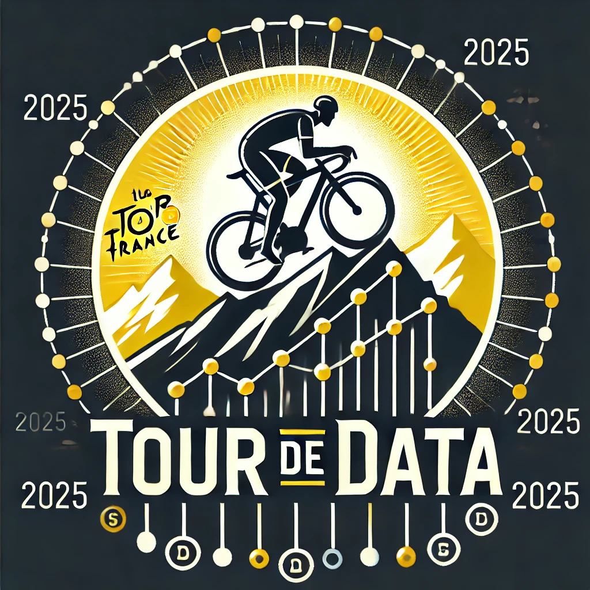

  
  <h1>Tour de Data 2025</h1>

**Tour of Data 2025** is a data visualization project that dives beneath the surface of **professional cycling** to uncover the hidden patterns shaping the sport today. Cycling is not only a test of endurance and strategy — it's also a rich source of data that reveals deeper **insights about performance, nationality, and progression over time**.

Using real-world statistics from **[ProCyclingStats](https://www.procyclingstats.com/)** and powered by the **[Procyclingstats Python package](https://procyclingstats.readthedocs.io/en/latest/)**, we analyze trends such as the age distribution of race winners, shifts in national dominance, and correlations between performance and contextual factors like team composition or bike brand.

Through **interactive and visually engaging dashboards**, Tour of Data 2025 brings these stories to life — **turning raw numbers into meaningful insights** and offering a fresh lens on the ever-evolving world of professional cycling.

