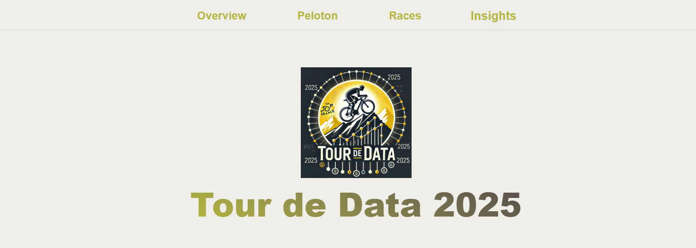
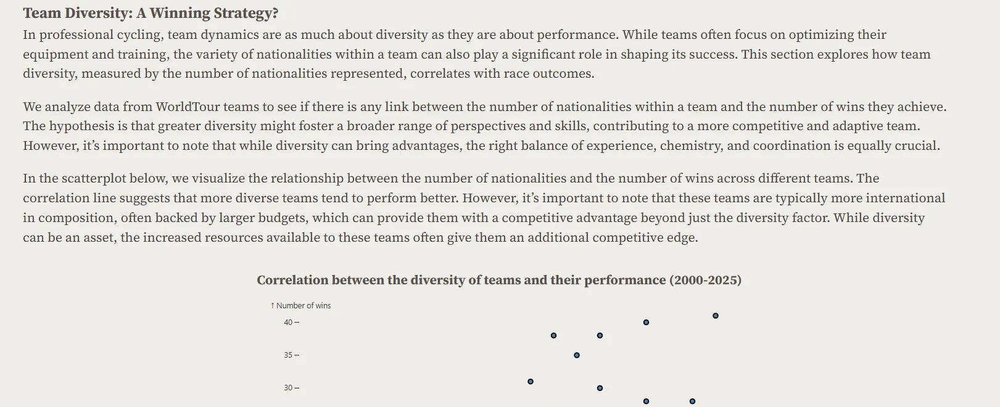

# Verslag

**Dataset en Python Package**

De eerste stap van het project bestond uit het verkennen van de [https://www.procyclingstats.com/](https://www.procyclingstats.com/index.php) website en het Python package [https://procyclingstats.readthedocs.io/en/latest/](https://procyclingstats.readthedocs.io/en/latest/). Er is heel veel informatie beschikbaar, vaak verspreid over verschillende plaatsen. Hiervan vertrekkende hebben we een aantal interessante pagina’s met data onderverdeeld in de pagina’s Peloton-Races-Insights om een duidelijk verhaal te creëren.

**Opzetten van Observable Framework, GitHub en GitHub Actions**

Voor het beginnen aan mockups of concepten kozen we ervoor om het Observable Framework te gebruiken om onze website op te zetten. We kozen ervoor om af te stappen van het standaard “Dashboard” gevoel en meer richting een echte website te werken. Op die manier is er ook een beter onderscheid tussen de verschillende pagina’s die lost staan van elkaar. 

**Start concept van interactieve kaart (zowel voor renners in peloton als winnaars van races)**

**Uitbreiden van kaarten met lijst van winnaars / renners van geselecteerde land op kaart**

**Start grafiek gemiddelde leeftijd over jaren en jongste leeftijden in peloton (later weggelaten gezien niet overtuigd van meerwaarde en passend in het verhaal)**

**Start concept van verdeling leeftijd peloton**

**Toevoegen van knoppen voor het selecteren van specifieke race**

**Verbetering leeftijdplot door winnaars / niet winnaars te onderscheiden**

**Start detail plot race over afstand en gemiddelde snelheid**

**Start insights page met absolute aantallen equipments**

**Uitbreiden insights met aantal overwinningen per brand**

**Verbeteren detail plot race met medailles en annotaties periodes**

**Barplot voor overwinningen per land en start idee podium**

**Verbetering podium door conversie naar echte bar charts**

**Verbetering barplot voor overwinningen door toevoegen vlaggen**

**Uitbreiden van kaart zodat bij deselecteren van land volledige erelijst van race wordt getoond**

**Uitbreiden van kaart over World-Tour peloton met sortering van lijst op aantal overwinningen behaald**

**Toevoegen van scatterplot en correlatie tussen aantal overwinningen en team diversiteit**

**Toevoegen van optie “aantal deelnemers” voor race details**

**Toevoegen van beschrijvende tekst**

**Verbeteringen aan layout van buttons om duidelijker te maken welke geselecteerd**

**Verbeteren layout detail plot race met grid, annotatie voor punten die extra info bevatten (in rood) en duidelijkere toggle in plaats van switcher**

**All-Time overzicht van leeftijd voor makkelijke vergelijking tussen verdeling van geselecteerde jaar en all-time verdeling**

**Aanduiden van belangrijke sleutelwoorden in vet**

## **Taakverdeling**

| **Naam** | **Taken** |
| --- | --- |
| Jarne Clauw | Opzetten cache-structuur voor makkelijkere development, data retrieval organiseren zodat alle data overzichtelijk beschikbaar, leeftijd plot |
| Tybo Verslype | Leeftijd verdeling, algemene leeftijd over tijd |
| Bram Meir | Insights page, interactieve kaarten, podium plot, race details |